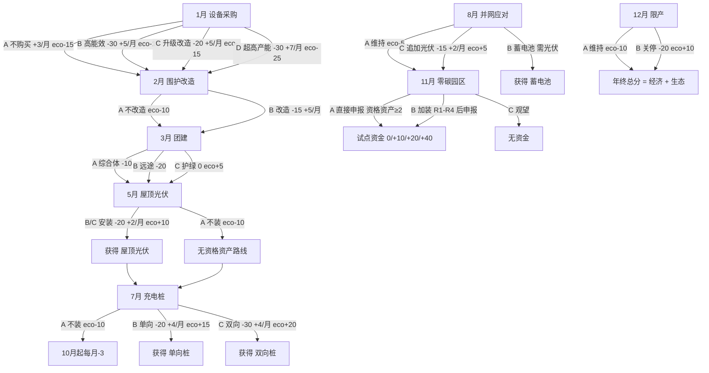

# 《绿神话》企业视角决策树与结局分析

> 整理日期：2026-09-10  
> 依据：`web/js/engine.js`、`web/js/events.js`、`temp/ending-scenarios.js` 模拟输出。  
> 所有终局数值来自现行结算引擎实际跑局，未调整任何结算数值。

## 1. 模拟口径

为保证 10 条路线可以横向比较，统一采用"中性偏从轻"的外部环境：

| 项目 | 模拟设定 |
| --- | --- |
| 政府生态奖惩（2/8/11 月） | 从轻档（±10） |
| 4 月公共卫生 | 正常生产，骰子取代表性点数 |
| 6 月光伏补贴 | 给予（已装光伏企业逐月 +2） |
| 9 月极端天气 | 光伏抗风骰取 2（设备完好）；抗灾韧性线取 1（光伏损毁）作对照 |
| 9 月停电应对 | 部分限电（每家 -10） |
| 11 月试点资金 | 第 3 档（+20）；资金保守线取第 1 档（+0）作对照 |
| 12 月 | 按各路线选择结算 |

每条路线中三家模拟企业选择相同时，生态奖惩因"并列最低且最高相抵"而中性化；濒危救助路线通过对照企业差异化选择，让生态最低惩罚真实落到激进企业头上，确保救助情景真实触发。

## 2. 企业视角关键决策点

| 月份 | 决策 | 选项要点 | 对后续的影响 |
| --- | --- | --- | --- |
| 1 月 | 设备采购 | A 不购 / B 高能效 / C 升级改造 / D 超高产能 | 全年每月收益流（3~7）与生态基调（-15~-25）；D 路线经济优势以全年生态透支为代价 |
| 2 月 | 围护结构改造 | A 不改造（生态 -10）/ B 改造（-15 换每月 +5） | B 是绿色路线经济回血起点，也是 2 月生态奖惩排名的关键变量 |
| 3 月 | 团建地点 | A 综合体 / B 远途 / C 护绿 | 当月疫情损益，另有 4-12 月员工积极性经济流：A 0、B +2/月、C -2/月；C 是唯一生态加分项 |
| 5 月 | 屋顶光伏 | A 不装 / B 自发自用 / C 全额上网（数值等价） | 获得资格资产"屋顶光伏"；决定 6 月补贴、9 月抗风骰、8 月蓄电池资格、11 月申报资格 |
| 7 月 | 充电桩 | A 不装 / B 单向 / C 双向 | 免除 10 月油价每月 -3；C 直接获得双向桩资格资产；B 需在 11 月花 -10 升级 |
| 8 月 | 并网受限应对 | A 维持 / B 蓄电池（需已装光伏）/ C 追加光伏 | B/C 都是资格资产；B 与光伏组合获得 9 月自备电力双重加成资格 |
| 11 月 | 零碳园区申报 | A 直接申报 / B 加装后申报 / C 观望 | 合格（资格资产 ≥2）才有试点资金资格；加装 R1-R4 是最后的资产补救窗口 |
| 12 月 | 限产应对 | A 维持（生态 -10）/ B 关停部分产线（经济 -20、生态 +10） | 终盘最后一笔分数交换；绿色路线用 -20 换 +10 并守住生态底线 |

## 3. 完整分支树

外部节点（不可选但影响分支）：4 月政府停工/生产骰、6 月光伏补贴、9 月抗风骰与停电三选、10 月油价自动结算、2/8/11 月生态奖惩力度。

## 4. 十类代表性结局

| 结局 | 路线要点 | 经济 | 生态 | 总分 | 资格资产 | 政府财政 |
| --- | --- | ---: | ---: | ---: | --- | ---: |
| 绿色冠军 | C-B-C-C-C-B-A-B | 139 | 100 | 239 | 3 项 | 34 |
| 稳健转型 | B-B-C-C-B-B-A-B | 139 | 100 | 239 | 2 项 | 34 |
| 补装冲刺 | C-B-C-A-C-A-B(R1)-B | 110 | 75 | 185 | 2 项 | 40 |
| 抗灾韧性 | 同绿色冠军，9 月骰 1 光伏损毁 | 129 | 100 | 229 | 3 项 | 34 |
| 高碳风险 | D-A-B-A-A-A-C-A | 70 | -30 | 40 | 0 项 | 100 |
| 濒危获救 | D-A-B-A-A-A-C-A，4 月破产获救 | 45 | -30 | 15 | 0 项 | 90 |
| 政策弃救 | 同濒危获救，政府放弃救助 | 35 | -30 | 5 | 0 项 | 100 |
| 设备空转 | A-A-A-C-C-B-A-B | 85 | 80 | 165 | 3 项 | 4 |
| 错失试点 | 同绿色冠军，11 月观望 | 119 | 100 | 219 | 3 项 | 94 |
| 资金保守 | 同绿色冠军，资金第 1 档 | 119 | 100 | 219 | 3 项 | 94 |

### 各结局复盘要点

**绿色冠军（239）**：升级改造打底，五个绿色资产在 5 月前铺开两条，8 月补蓄电池凑齐三项资格，11 月直接申报拿第 3 档资金。经济与生态双高，是"早投入早回血"的标准答案。课堂复盘重点：1 月 C 选项用最少的 -20 换来与 B 相同的每月 +5。

**稳健转型（239）**：1 月选 B 高能效设备，7 月装单向桩，资格资产只有光伏和蓄电池两项。总分与绿色冠军完全持平，说明 1 月 B 和 C 等价、7 月 B 与 C 的 10 分差被后续路径抹平。复盘价值： Green 路线内部也有容错空间。

**补装冲刺（185）**：前 8 月省着花，11 月用 R1 临时加装光伏凑资格。总分比绿色冠军低 54，差距来自 5 月到 11 月这半年光伏收益流与补贴流的缺失。复盘价值：绿色转型的时间价值，晚装一个半年，损失半年的复利。

**抗灾韧性（229）**：与绿色冠军同路线，但 9 月掷出 1，光伏损毁 -10。总分只下滑 10，且不损失资格资产。复盘价值：绿色资产组合在极端天气下的韧性，一次灾害打不垮结构。

**高碳风险（40）**：猛兽设备 + 全程不装资产，靠 D 设备每月 +7 撑现金流，最终经济 70 但生态 -30。总分 40 远低于所有绿色路线。复盘价值：高路线不破产但垫底，"活着"与"赢"是两件事。

**濒危获救（15）**：比高碳风险更激进，叠加 2 月生态垫底被罚、3 月远途团建、4 月掷出 1，经济击穿 20 触发救助。政府 +10 后终局仍只有 15。复盘价值：救助托底存在，但救回来也只是体面地输。

**政策弃救（5）**：与濒危获救同路线，政府放弃救助，终局 5 分。与濒危获救的 10 分差即救助的精确价值。复盘价值：政府救助决策对企业是生死分野，对政府财政只花 10。

**设备空转（165）**：1、2、3 月全程躺平，5 月起才装光伏、充电桩、蓄电池。生态 80 很好，但经济 85 被前期的零收益拖累，政府财政只剩 4（6 月补贴 + 11 月资金发得太狠）。复盘价值：起步犹豫的代价与政府财政纪律的重要性。

**错失试点（219）**：资产齐备却 11 月观望，少了 +20 资金。总分只低 20，但少了"零碳园区"叙事头衔。复盘价值：申报资格是免费的，观望只有下行风险。

**资金保守（219）**：申报合格但政府只发第 1 档（0）。与错失试点同分。复盘价值：企业无法控制政府档位，能控制的是让自己保持合格。

## 5. 关键选项分析

### 1 月设备路线：全年基调

- C 升级改造是效率之王：-20 换每月 +5、生态 -15，与 B 同收益但便宜 10。
- D 猛兽设备每月 +7 全场最高，但生态 -25 让 2 月几乎必然垫底被罚，且关死了后续绿色路线的经济空间。
- A 不购买每月 +3 看似免费，实际是全场最低收益流，绿色路线选它等于自废武功。

### 5 月屋顶光伏：资格与现金流的分水岭

- -20 买断三项权益：每月 +2 收益流、6 月起补贴 +2 流、9 月自备电力 +5。
- 资格资产本身：8 月蓄电池、11 月申报都以它为前置。
- 9 月抗风骰是唯一风险，半数概率 -10，但期望损失 -5 远小于半年收益流。

### 7 月充电桩：10 月油价的保险单

- B/C 任一选项直接免疫 10 月起的每月 -3 流。
- C 双向桩多花 10 买断资格资产与 9 月自备电力 +5；B 单向桩需 11 月花 -10 升级，总价与 C 持平但晚了 4 个月。

### 8 月蓄电池：组合资产的核心

- B 选项硬性要求已装光伏，是全游戏唯一的前置条件选项。
- 光伏 + 蓄电池组合后，9 月自备电力可拿光伏 +5 与储电 +5 共 +10。
- 三项资格资产凑齐后，11 月申报无悬念。

### 11 月申报与资金：终盘排名的分仓

- 观望（C）损失区间 0~40；合格申报的价值下限是 0、上限是 40，永远不亏。
- 加装（B）是最后补救窗口：R1 光伏 -18 性价比最高，R3 单向升级双向 -10 最便宜。
- 资金档位掌握在政府手里，第 3 档 +20 是模拟中位数。

### 12 月限产：最后的生态兜底

- B 关停 -20 换 +10 生态，净 -10 分，但把生态拉离危险区。
- A 维持 +0 换 -10 生态，对高生态企业是白送的扣分。
- 绿色路线选 B 是姿态也是保险；高碳路线选 B 已无意义（生态早已 -30）。

## 6. 结论：胜负手排序

按对终局总分的影响幅度排序：

1. 5 月光伏（资格 + 四条收益流的起点）
2. 1 月设备（每月 3~7 的全年基调）
3. 8 月蓄电池（组合加成与资格第三块拼图）
4. 7 月充电桩（油价免疫与第二资格资产）
5. 11 月申报与资金（0~40 的免费期权）
6. 12 月限产（-10 ~ +10 的尾部调整）
